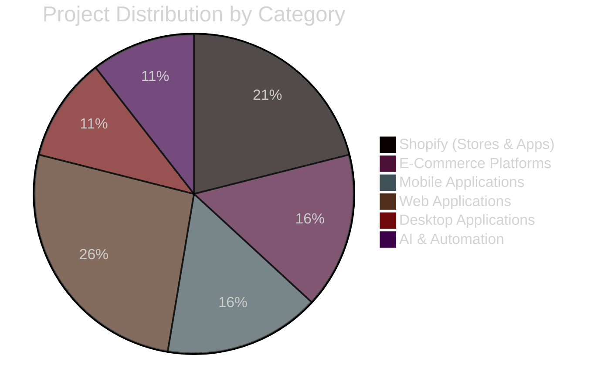

<div align="center">

<!-- Animated Header with Custom Typography -->


<br/>

<!-- Dynamic Typing Effect -->


<br/>

<!-- Stylized Contact Badges -->
<p align="center">
  <a href="mailto:aftabahmadkhan.dev@gmail.com">
    
  </a>
  <a href="http://aftabahmadkhan.site">
    
  </a>
</p>

<p align="center">
  <a href="https://linkedin.com/in/aftab-ahmad-khan">
    
  </a>
  <a href="https://github.com/aftab-ahmad-khan-dev">
    
  </a>
  
</p>

</div>

<br/>

<!-- Professional Statement with Visual Separation -->
<div align="center">
<table>
<tr>
<td width="100%">

```typescript
const aftabAhmadKhan = {
    role: "Senior Full-Stack & AI Developer",
    expertise: ["MERN Stack", "Shopify", "React Native", "AI Automation"],
    experience: "7+ years",
    projectsDelivered: 75,
    currentFocus: "Building intelligent, scalable solutions",
    availability: "Open for exciting opportunities",
    mantra: "Code with purpose, build with passion, deliver with precision"
};
```

</td>
</tr>
</table>
</div>

<br/>

---

<div align="center">

## 🎯 **PROFESSIONAL IMPACT**

</div>

<table width="100%">
<tr>
<td width="25%" align="center">

<br/><b>Projects Delivered</b>
</td>
<td width="25%" align="center">

<br/><b>Client Satisfaction</b>
</td>
<td width="25%" align="center">

<br/><b>Years Experience</b>
</td>
<td width="25%" align="center">

<br/><b>Users Reached</b>
</td>
</tr>
</table>

<br/>

---

<div align="center">

## 💼 **WHAT I DO**

</div>

```diff
+ Full-Stack Development    → Architecting scalable MERN applications with modern best practices
+ Shopify Expertise         → Custom themes, stores, apps & embedding for e-commerce dominance
+ Mobile Development        → Cross-platform React Native apps with AI-powered features
+ Desktop Solutions         → Electron.js applications turning web apps into native experiences
+ AI Integration            → OpenAI APIs, intelligent agents, n8n automation workflows
+ Technical Leadership      → Managing teams of 20-25 developers, Agile methodologies
```

<br/>

---

<div align="center">

## 🛠️ **TECHNOLOGY ARSENAL**

</div>

<table width="100%">
<tr>
<td valign="top" width="33%">

### 🎨 Frontend & Mobile


</td>
<td valign="top" width="33%">

### ⚙️ Backend & Database


</td>
<td valign="top" width="34%">

### 🚀 Specialized & AI


</td>
</tr>
</table>

<br/>

---

<div align="center">

## 📊 **PROJECT PORTFOLIO BREAKDOWN**

</div>



<br/>

<table width="100%">
<tr>
<th>Category</th>
<th>Projects</th>
<th>Core Technologies</th>
<th>Impact</th>
</tr>
<tr>
<td><b>🛍️ Shopify Solutions</b></td>
<td align="center">20+</td>
<td>Custom Themes, Apps, Embedding, CRO</td>
<td>↑ Sales & Engagement</td>
</tr>
<tr>
<td><b>🌐 E-Commerce Platforms</b></td>
<td align="center">15+</td>
<td>MERN, Payment Gateways, Admin Panels</td>
<td>100K+ Users</td>
</tr>
<tr>
<td><b>📱 Mobile Apps</b></td>
<td align="center">15+</td>
<td>React Native, Expo, AI Features</td>
<td>iOS & Android</td>
</tr>
<tr>
<td><b>💻 Web Applications</b></td>
<td align="center">25+</td>
<td>Next.js, Real-time, AI-Enhanced</td>
<td>60% Faster Load</td>
</tr>
<tr>
<td><b>🖥️ Desktop Apps</b></td>
<td align="center">10+</td>
<td>Electron.js, Cross-Platform</td>
<td>Win/Mac/Linux</td>
</tr>
<tr>
<td><b>🤖 AI & Automation</b></td>
<td align="center">10+</td>
<td>OpenAI, n8n, Intelligent Agents</td>
<td>40-70% Efficiency</td>
</tr>
</table>

<br/>

---

<div align="center">

## 🎓 **CORE COMPETENCIES**

</div>

<div align="center">

```yaml
Technical Excellence:
  - Full-Stack Architecture & Development
  - Performance Optimization (60% faster load times)
  - Secure Authentication (JWT, Clerk, Firebase)
  - RESTful & GraphQL API Design
  - Real-Time Features (WebRTC, WebSockets)
  - Payment Integration (Stripe, MyFatoorah)
  - CI/CD Pipeline Implementation (60% faster deployment)

Shopify Specialization:
  - Custom Theme Development
  - Full Store Setup & Configuration
  - Custom App Development & Embedding
  - Third-Party App Integrations
  - Performance & CRO Optimization
  - Conversion Rate Enhancement

AI & Innovation:
  - OpenAI API Integration
  - Hugging Face Models
  - Intelligent Agent Development
  - n8n Workflow Automation
  - Predictive Analytics
  - AWS Lambda Functions

Leadership & Management:
  - Team Leadership (20-25 developers)
  - Agile/Scrum Methodologies
  - Sprint Planning & Execution
  - Client Communication & Consulting
  - Code Review & Mentorship
  - Requirement Gathering & Analysis
```

</div>

<br/>

---

<div align="center">

## 🏆 **KEY ACHIEVEMENTS**

</div>

<table width="100%">
<tr>
<td width="50%">

- ⚡ **Performance Optimization**: Achieved 60% faster load times through advanced techniques
- 📈 **Scalability**: Scaled applications to serve 100,000+ concurrent users
- 🚀 **Deployment Efficiency**: Reduced deployment times by 60% with CI/CD
- 🤝 **Client Satisfaction**: Maintained 100% satisfaction rate across 75+ projects

</td>
<td width="50%">

- 🎯 **Automation Impact**: Delivered 40-70% efficiency gains through AI automation
- 👥 **Team Leadership**: Successfully led and mentored teams of 20-25 developers
- 💼 **Industry Diversity**: Served E-Commerce, FinTech, Healthcare, Education sectors
- 🛡️ **Security Focus**: Implemented robust security protocols across all projects

</td>
</tr>
</table>

<br/>

---

<div align="center">

## 🌟 **SERVICES OFFERED**

</div>

<table width="100%">
<tr>
<td width="50%" valign="top">

### 🔷 Development Services

**Full-Stack Web Development**
- MERN Stack Applications
- Next.js & React Solutions
- RESTful & GraphQL APIs
- Real-time Features
- Performance Optimization

**Mobile App Development**
- React Native (iOS & Android)
- Expo Framework
- AI-Powered Features
- Push Notifications
- App Store Deployment

**Desktop Application Development**
- Electron.js Solutions
- Cross-Platform (Win/Mac/Linux)
- Native-like Performance
- Auto-Update Systems

</td>
<td width="50%" valign="top">

### 🔶 Specialized Services

**Shopify Expertise**
- Custom Theme Development
- Complete Store Setup
- Custom App Development & Embedding
- Third-Party Integrations
- CRO & Performance Optimization
- Sales Enhancement Strategies

**AI & Automation**
- OpenAI API Integration
- Intelligent Agent Development
- n8n Workflow Automation
- Predictive Analytics
- Process Automation (40-70% efficiency gains)

**Technical Leadership**
- Solution Architecture
- Team Management & Mentorship
- Agile Project Management
- Technical Consulting

</td>
</tr>
</table>

<br/>

---

<div align="center">

## 📈 **GITHUB ANALYTICS**

</div>

<p align="center">
  
  
</p>

<p align="center">
  
</p>

<p align="center">
  
</p>

<br/>

---

<div align="center">

## 🎨 **CONTRIBUTION SNAKE**

</div>

<picture>
  <source media="(prefers-color-scheme: dark)" srcset="https://raw.githubusercontent.com/aftab-ahmad-khan-dev/aftab-ahmad-khan-dev/output/github-contribution-grid-snake-dark.svg">
  <source media="(prefers-color-scheme: light)" srcset="https://raw.githubusercontent.com/aftab-ahmad-khan-dev/aftab-ahmad-khan-dev/output/github-contribution-grid-snake.svg">
  
</picture>

<br/><br/>

---

<div align="center">

## 💡 **LET'S BUILD SOMETHING AMAZING**

</div>

<div align="center">

```javascript
// Available for:
const opportunities = {
    projectTypes: ['Fixed-Price', 'Hourly', 'Long-Term Partnership'],
    specialization: ['Enterprise Solutions', 'Shopify E-Commerce', 'AI Integration'],
    commitment: 'Future-Ready, Scalable, Intelligent Solutions',
    location: 'Multan, Pakistan',
    timezone: 'UTC+5',
    status: '✅ Available for New Projects'
};

// Let's connect and turn your vision into reality!
```

</div>

<br/>

<div align="center">

### 📬 **GET IN TOUCH**

<p>
<a href="mailto:aftabahmadkhan.dev@gmail.com">
  
</a>
<a href="http://aftabahmadkhan.site">
  
</a>
<a href="https://linkedin.com/in/aftab-ahmad-khan">
  
</a>
</p>

</div>

<br/>

---

<div align="center">

### ⭐ **If you find my work interesting, consider giving a star to my repositories!**

<p>
<i>"Code with purpose, build with passion, deliver with precision."</i>
</p>

<br/>

**Building scalable, intelligent, and growth-driven solutions worldwide** 🌍

<br/>


</div>
